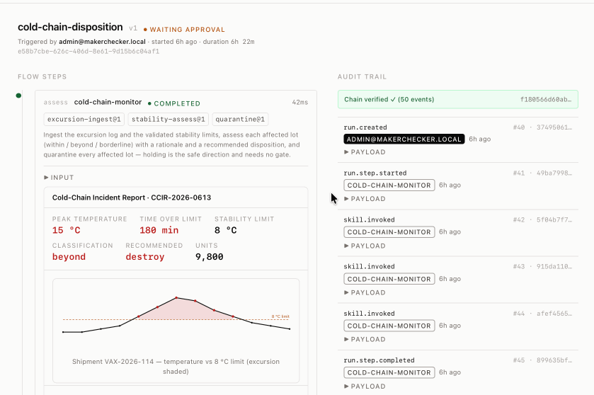

# MakerChecker

[](https://github.com/sammysltd/makerchecker/actions/workflows/ci.yml)
[](https://github.com/sammysltd/makerchecker/releases/latest)
[](LICENSING.md)

Self-hosted software that governs AI agents. Each agent gets one role, deny-by-default skill grants pinned to an exact version, segregation-of-duties constraints, n-of-m human approval gates, per-skill limits, and a hash-chained Ed25519-signed audit log that an external party verifies offline. Agents keep running in their existing framework. MakerChecker is the authorization checkpoint and the record.

The application is a Fastify server on Postgres. Agents connect as a flow (MakerChecker orchestrates sequential steps and gates) or as a proxy session (MakerChecker authorizes and records tool calls another framework executes). Both write the same audit chain.

[Live demo](https://makerchecker.ai/demo/): an agent is blocked from approving its own work, a human signs off, and the run's audit chain comes back verified. No signup.



## Overview

The gateway intercepts agent actions at the boundary. Agents do not execute high-risk operations directly; they invoke tools or skills through MakerChecker API sessions or flows.

1. **Policy declaration**: Roles are assigned to agents, and unrevocable grants bind roles to exact skill versions.
2. **Boundary check**: Every tool call is intercepted. The gateway checks if the agent's role possesses an unrevoked grant for that skill version and verifies that configured limits are respected.
3. **Approval gating**: High-risk steps are held at human approval gates. The flow halts until the specified approvers decide the request.
4. **Append-only log**: State changes and tool calls write to a hash-chained database ledger. Each event contains the cryptographic signature of the preceding event, securing the execution history.

## Quickstart

```bash
docker compose up
```

This starts Postgres and binds the server to port 3000. On first boot, the database seeds demo configurations and prints two API keys: an admin key and an officer key. Copy these keys from the startup logs.

The seed includes a pre-configured cash reconciliation flow with a maker-checker constraint. To trigger the flow:

```bash
export H='authorization: Bearer mk_...'   # replace with the admin key from logs

# Trigger the demo flow
curl -X POST localhost:3000/api/flows/daily-cash-reconciliation/runs -H "$H" -H 'content-type: application/json' -d '{}'

# Inspect the pending approval gate
curl localhost:3000/api/approvals -H "$H"

# Approve the gate
curl -X POST localhost:3000/api/approvals/<id>/decision -H "$H" -H 'content-type: application/json' \
  -d '{"decision":"approved","reason":"Exceptions resolved"}'

# Verify the audit chain integrity
curl localhost:3000/api/audit/verify -H "$H"
```

For the step-by-step local setup or to run with models, see [docs/quickstart.md](docs/quickstart.md).

The quickstart connects as the Postgres owner, which disables the append-only audit triggers. For tamper-resistance against a compromised app credential, run the server as a non-owner role with [`docker-compose.hardened.yml`](docker-compose.hardened.yml) ([walkthrough](docs/security-model.md#database-hardening-walkthrough)).

## Packages

pnpm workspaces with Turborepo. The server code is AGPL-3.0. The SDKs and connectors (Apache-2.0) carry no copyleft obligation, so they are safe to embed directly.

| Package | License | What it is |
|---|---|---|
| [`packages/server`](packages/server) | AGPL-3.0 | Fastify API, flow engine, workers, audit writer, demo seed, `cli.js` admin tool. |
| [`packages/web`](packages/web) | AGPL-3.0 | Vite/React SPA: run viewer, approvals inbox, registry. |
| [`packages/shared`](packages/shared) | AGPL-3.0 | Domain types, TypeBox schemas, RFC 8785 canonical JSON, hash utilities. |
| [`packages/sdk`](packages/sdk) | Apache-2.0 | Typed TypeScript HTTP client plus the `governedTool` wrapper. |
| [`packages/sdk-python`](packages/sdk-python) | Apache-2.0 | Typed Python HTTP client plus `governed_tool`. |
| [`packages/connector-langchain`](packages/connector-langchain) | Apache-2.0 | `governLangChainTool` / `governToolkit` for LangChain `StructuredTool`s. |
| [`packages/connector-claude-agent`](packages/connector-claude-agent) | Apache-2.0 | `governClaudeTool` for Claude Agent SDK custom tools. |

The governed primitives are Agent, Role, Skill, Trigger, Flow, Run/Audit, all Postgres-backed and versioned. See [docs/concepts.md](docs/concepts.md).

## Integration

Open a proxy session, then wrap each tool. Every invocation calls `proxy.check` (a deny throws `GovernanceDeniedError` before the tool runs), runs the tool, and calls `proxy.record` with the output. High-risk skills are refused on the proxy path; they require a flow gate.

```ts
import { createClient, governedTool, GovernanceDeniedError } from "@makerchecker/sdk";

const client = createClient({ baseUrl: "http://localhost:3000", apiKey: "mk_..." });
const { session } = await client.proxy.openSession({ label: "recon-run" });

const match = governedTool(
  client,
  session.id,
  "recon-preparer",   // registered agent whose role grants are evaluated
  "txn-match@1",       // skillRef: name@version
  (input: { statement: unknown[]; ledger: unknown[] }) => matchTxns(input),
);

await match({ statement, ledger }); // throws GovernanceDeniedError if denied
await client.proxy.closeSession(session.id);
```

LangChain: `governLangChainTool` returns a `DynamicStructuredTool` with the same `name`, `description`, and `schema`. See [examples/connectors/langchain](examples/connectors/langchain/README.md). Claude Agent SDK: `governClaudeTool` returns an `SdkMcpToolDefinition` for `createSdkMcpServer`; see [packages/connector-claude-agent/README.md](packages/connector-claude-agent/README.md). Python: `create_client` then `governed_tool`, works with CrewAI, LangChain, LlamaIndex, AutoGen; `pip install makerchecker`, see [packages/sdk-python/README.md](packages/sdk-python/README.md).

## Audit and verification

Every state transition emits an audit event in the same database transaction as the state write. Each event hash is `SHA-256` over the RFC 8785 canonical JSON of the event (the `seq` column excluded), chained through `prev_hash`, rooted in a genesis event derived from the instance UUID. Tampering with any row breaks recomputation at that row.

`GET /api/audit/verify` walks the chain and returns `{ ok, count, headHash }`, or `{ ok: false, failedSeq, reason }` on a break. The server CLI verifies the live chain and signed bundles offline:

```bash
# verify against the running database
docker compose exec server node dist/cli.js audit verify

# export a signed bundle, then verify it with no database
docker compose exec server node dist/cli.js audit export --out bundle.json
node dist/cli.js audit verify-bundle --in bundle.json
node dist/cli.js audit verify-bundle --in bundle.json --key instance.pub  # pin the key
```

Bundles are Ed25519-signed and carry the manifest to recompute the chain independently. The format is specified in [docs/audit-spec.md](docs/audit-spec.md) for reimplementation in any language. `audit report --run <id>` produces a self-contained HTML run report with chain verification; `audit access-review` renders the role/grant/SoD review (also at `/api/reports/access-review`).

## Status

This is MakerChecker 1.0. The server, web, shared, integration, and verification paths are covered by unit and integration tests running against Postgres in CI.

1.0 does not include a drag-and-drop flow builder, SSO/SAML, or multi-tenancy. Flow definitions are authored as typed JSON/YAML; SSO/SAML and multi-tenancy are planned commercial add-ons ([LICENSING.md](LICENSING.md)).

## License

The server, web, and shared packages are AGPL-3.0 ([LICENSE](LICENSE)). The SDKs, connectors, and examples are Apache-2.0. Code embedded in your own systems does not carry AGPL obligations; the boundary is the network API. A commercial license without copyleft obligation is available for organizations whose policies preclude AGPL-3.0: hello@makerchecker.ai. Rationale: [LICENSING.md](LICENSING.md).

Contributing: [CONTRIBUTING.md](CONTRIBUTING.md) · Security: [SECURITY.md](SECURITY.md) · Code of Conduct: [CODE_OF_CONDUCT.md](CODE_OF_CONDUCT.md) · Changelog: [CHANGELOG.md](CHANGELOG.md)
